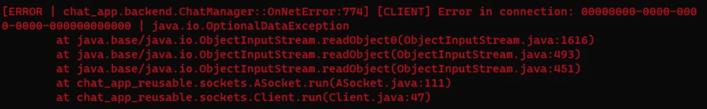
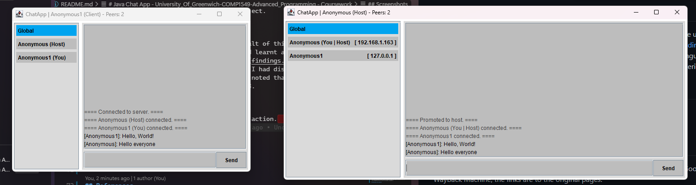
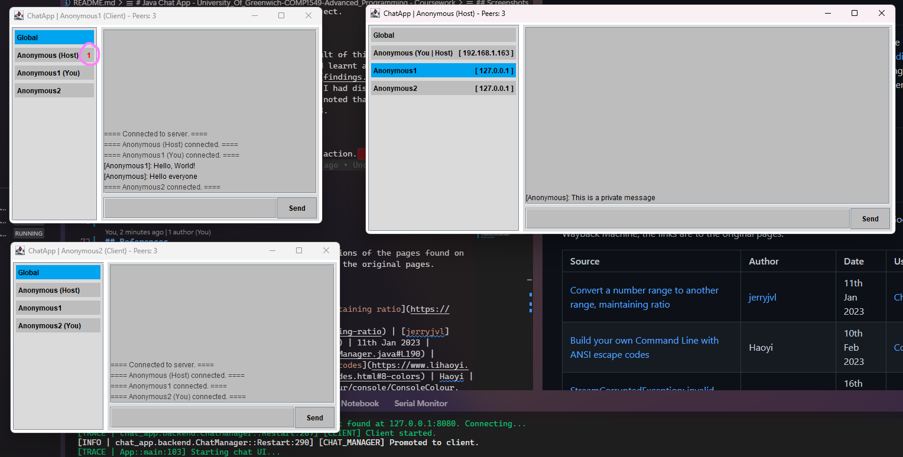
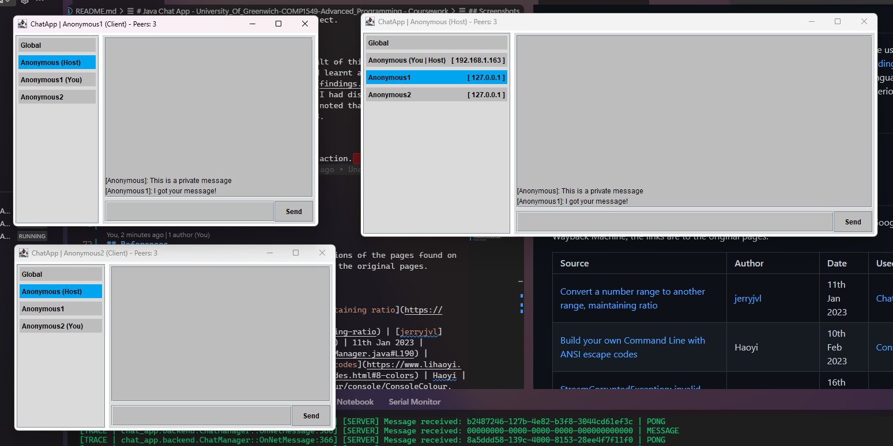
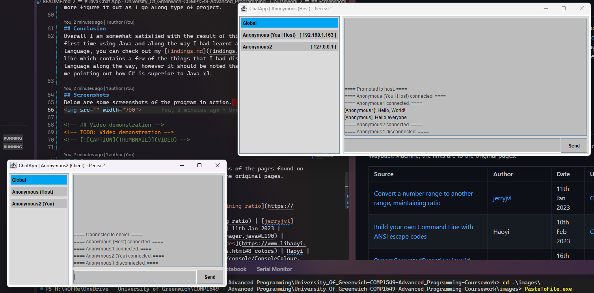
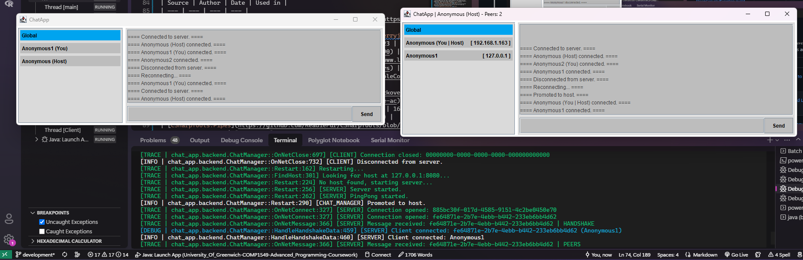

# Java Chat App - University_Of_Greenwich-COMP1549-Advanced_Programming - Coursework

## Index
- [Java Chat App - University\_Of\_Greenwich-COMP1549-Advanced\_Programming - Coursework](#java-chat-app---university_of_greenwich-comp1549-advanced_programming---coursework)
  - [Index](#index)
  - [Introduction](#introduction)
  - [Project overview](#project-overview)
  - [Bugs](#bugs)
  - [Testing](#testing)
  - [Improvements](#improvements)
  - [Conclusion](#conclusion)
  - [Screenshots](#screenshots)
  - [Video demonstration](#video-demonstration)
  - [References](#references)
  - [Running the program](#running-the-program)
    - [Running/building from source](#runningbuilding-from-source)
    - [Running from release](#running-from-release)
  - [Grading feedback](#grading-feedback)
    - [Implementation:](#implementation)
      - [Group Formation, Connection and Communication: 10/10](#group-formation-connection-and-communication-1010)
      - [Group State Maintenance: 10/10](#group-state-maintenance-1010)
      - [Coordinator Selection:  10/10](#coordinator-selection--1010)
      - [Use of Design Patterns:  10/10](#use-of-design-patterns--1010)
      - [Fault Tolerance:  10/10](#fault-tolerance--1010)
      - [JUnit Based Testing of the Application:  10/10](#junit-based-testing-of-the-application--1010)
      - [Use of Component-Based Development:  10/10](#use-of-component-based-development--1010)
    - [Report:](#report)
      - [Introduction:  4/4](#introduction--44)
      - [Design/Implementation:  10/10](#designimplementation--1010)
      - [Analysis and Critical Discussion:  8/8](#analysis-and-critical-discussion--88)
      - [Conclusions:  4/4](#conclusions--44)
      - [Presentation Style:  4/4](#presentation-style--44)
    - [Total: 100%](#total-100)

## Introduction
This repository contains the coursework source code and specification for the Advanced Programming module (COMP1549) at the University of Greenwich.  
Everyone was tasked with creating a chat application in Java. This application had to provide the following features:
- The ability to pass a server `IP`, `port` and `username` as command line arguments, or to be prompted for them if they were not provided.
- Connect to an existing server at the specified address, or create a new server if one did not exist.
- Be able to publicly and privately send messages between connections via the server.
- Be able to automatically migrate hosts when the server is shut down.

## Project overview
The application could be made as either a command line interface or a graphical user interface.  

While initially I had planned to create a command line based tool, I moved to using a graphical user interface as it would ease development due to the requirement of being able to privately send messages and the difficulty of interrupting and handling command line input buffers.  

I was unsure if we were allowed to use any external libraries for this project, so I decided to create everything from scratch where a default library did not exist for my needs.  

The networking in this application is split up into two parts, there is the core which handles the more generic network events and then there is the [`ChatManager`](src/chat_app/backend/ChatManager.java) which has code specific to this app.  
The networking core primarily uses the `java.net.Socket` and `java.net.ServerSocket` classes. I had created four classes that make use of these packages, [`Client`](src/readiefur/sockets/Client.java), [`ServerManager`](src/readiefur/sockets/ServerManager.java), [`ServerClientHost`](src/readiefur/sockets/ServerClientHost.java) and [`ASocket`](src/readiefur/sockets/ASocket.java). All four of these files were inspired by my [`CSharpTools.Pipes`](https://github.com/ReadieFur/CSharpTools/blob/main/src/CSharpTools.Pipes) project as I quickly noticed when researching java networking, that a very similar approach to my C# code could've been taken.  
To summarize these classes, the `ServerManager` class is responsible for creating a server which clients can then connect to, it create new socket connections as needed and manage all client and server events. The other two classes, `Client`, `ServerClientHost` are both implementations of the abstract `ASocket` class which contains many virtual methods that help wrap the functionality of the `java.net.Socket` class. The code in these two files only have minor differences.  
The `ChatManager` class is responsible for handling all of the chat specific events, such as handshaking with clients, managing message events, automatically migrating hosts and more. Once the core events have been processed by this class, it will then dispatch specific events for this app. Because this class is instanced and due to the fact it can automatically manage connections, you could create multiple instances in a single application, with this class not being a singleton it makes it useful for unit testing.

The frontend of this application is over-engineered, this is a thing I commonly do in my projects as I like to make my programs as modular as possible, so that in the future, like with what was seen in the networking core for this app, I can reuse the code in other projects.  
What I had overengineered was my UI parser, I was not a huge fan of the way `java.awt` and `javax.swing` handled UI creation, there would've been a lot of repetition if I had taken this approach. I have had previous experience using C#'s Windows Presentation Foundation (WPF), so I decided to create a similar XML parser for Java, this took me in total about 2 and a half days to create (over the weekend), it was also a good excuse to implement some reflection (and therefore annotations, aka attributes in C#) as bonus marks were available for this.  
To summarize how my UI parser works, any class that extends the [`XMLUI`](src/readiefur/xml_ui/XMLUI.java) class, when constructed, will automatically load an XML file with the same name as the owning class.  
The parser will then recursively parse the XML tree and attempt to build a UI.  
Tags on the XML nodes were used to customize the components and these tags were reflected on the corresponding component class to set the values.  
I had also added in some extra features from WPF, though simplified, namely static resources and one-way data binding. The ability to use static resources helped me reduce duplication and the one-way data binding helped me to make automatically syncing the state of the UI and the backend easier, this was one feature that I was especially proud of.

As a result of my design choices, we can see that my program will be primarily event driven, this is due to the multi-threaded nature of the `ServerManager` class and GUI events as well as the abstraction done to make interfacing with each class easier.

While I could've gone on for quite a bit more about the other things I did in this project, this section is already getting quite long, so I have decided to leave it there with the above key information about my development of the program.

## Bugs
While I have tried to keep the program as bug free as possible, it is almost always inevitable that bugs will be present in any program.  
For the most part, in my manual testing I have experienced very few bugs, however there is one that I have noticed that I have not been able to fix.  
Unfortunately this bug is extremely difficult for me to reproduce, therefore making it equally as hard for me to fix. The bug will occur at startup when a client is trying to connect to a server. I am unsure as to what exactly is causing this issue, however I feel like it could be a race condition on my automatic migration system, this could also explain why the bug is so hard to reproduce. But then looking at my error log and stack trace, the error seems to lie in parsing the data received which after reading the error code online, is due to corrupt data. This bug is considered to be a fatal bug to me because it renders the entire application unusable and floods the console with this error indefinitely. Below you can see a screenshot of the error and the stack trace.  
  
Other than this one very rare and very annoying bug, I have not experienced any other bugs in my testing.

## Testing
I have tested this application using both manual and JUnit (automated) testing.  
The automatic testing was done using JUnit, the tests that I have setup will test the backend of the program. I was going to additionally test the frontend of the program using Windows' UI Automation framework, however after a quick look into the Inspect tool, I noticed that none of the UI elements appeared, this was due to the fact that `java.awt` uses a custom render engine that is not compliant with the Windows UI Automation framework. So for the frontend testing, I had to resort to manually testing the GUI.

## Improvements
What I would've liked to improve on, I would've like to clean up the `ChatManager` class a lot more. While I had refactored it a few times (which can be seen by checking out my commit history), I feel like it could be cleaned up a lot more. It is messy in part due to the fact it started off as being a singleton class, which also contained the CLI code and me not being entirely sure how I wanted to structure the program, it ended up being a more figure it out as I go along type of project.

## Conclusion
Overall I am somewhat satisfied with the result of this project. It was my first time using Java and along the way I had learnt a fair amount about the language, you can check out my [findings.md](findings.md) file if you would like which contains a few of the things that I had discovered about the language along the way, however it should be noted that most of it is just me pointing out how C# is superior to Java x3.

## Screenshots
Below are some screenshots of the program in action.
- In this first image we can see a message being broadcasted to all clients.  
  
- In this next image we can see that the server has sent a private message to a client, and the client has received a notification indicating that they have an unread message.  
  
- In this image we can see that the peer "Anonymous1" has received a private message from the peer "Anonymous" and that the peer "Anonymous2" cannot see the message.
  
- In this image we can see that a system message has been placed into the global chat, indicated by a prefix and suffix of `====` as well as being in a light grey colour, that the peer "Anonymous1" has disconnected.
  
- In this final image we can see that the server has disconnected and that one of old clients have become the server and the other old client has automatically connected to the new server.
  

## Video demonstration
<!-- Embed mass storage video -->
<video src="./VideoDemonstration.mp4" width="700"></video>

## References
The timestamps used on here are from cached versions of the pages found on Google and the Wayback Machine, the links are to the original pages.

| Source | Author | Date | Used in |
| --- | --- | --- | --- |
| [Convert a number range to another range, maintaining ratio](https://stackoverflow.com/questions/929103/convert-a-number-range-to-another-range-maintaining-ratio) | [jerryjvl](https://stackoverflow.com/users/111781/jerryjvl) | 11th Jan 2023 | [ChatManager.java:190](src/chat_app/backend/ChatManager.java#L190) |
| [Build your own Command Line with ANSI escape codes](https://www.lihaoyi.com/post/BuildyourownCommandLinewithANSIescapecodes.html#8-colors) | Haoyi | 10th Feb 2023 | [ConsoleColour.java](src/readiefur/console/ConsoleColour.java) |
| [StreamCorruptedException: invalid type code: AC](https://stackoverflow.com/questions/2393179/streamcorruptedexception-invalid-type-code-ac)| [user207421](https://stackoverflow.com/users/207421/user207421) | 16th Feb 2023 | [ASocket.java:20](src/readiefur/sockets/ASocket.java#L20) |
| [CSharpTools.Pipes](https://github.com/ReadieFur/CSharpTools/blob/main/src/CSharpTools.Pipes) | [ReadieFur](https://github.com/ReadieFur) (aka me, Tristan Read) | 27th Jan 2023 | [ServerManager.java](src/readiefur/sockets/ServerManager.java) |
| [Interface WindowListener](https://docs.oracle.com/javase/7/docs/api/java/awt/event/WindowListener.html) | Oracle | 31st Jan 2023 | [Window.java:40](src/readiefur/xml_ui/controls/Window.java#L40) |

## Running the program
### Running/building from source
- Clone this repository
- Open in one of the pre-configured IDEs OR open in your own IDE
  - VSCode
  - IntelliJ IDEA
- Run or build the program targeting the `App.java` file.
  - If you have built the program from source and you want to execute the `RunScenario.bat` file, you will need to change the `JAR_FILE_NAME` variable to the name of the jar file you have built (the default is the name of the project source folder)

### Running from release
Please note that the built jar file on the releases page was built on OpenJDK 11.0.18. As a result if you are using a different version of Java, you may need to build the program from source.
- Download the latest release from the [releases page](./releases/latest)
- Either
  - Run a single instance by opening the `University_Of_Greenwich-COMP1549-Advanced_Programming-Coursework.jar` file
  - Run the `RunScenario.bat` file to open four instances of the program

## Grading feedback
This section contains the feedback and grading results of the coursework that was submitted.

### Implementation:
#### Group Formation, Connection and Communication: 10/10
The application has been developed as a GUI application. Good group formation and communication. It is possible to broadcast or send direct messages. The application is very user-friendly.

#### Group State Maintenance: 10/10
The group state is maintained very well. Messages are not timestamped, but it does indicate who a message is from.

#### Coordinator Selection:  10/10
Outstanding implementation of coordinator selection. I really like how you implemented the selection of a replacement host

#### Use of Design Patterns:  10/10
Great use of a number of design patterns, which have been correctly implemented.  
Exemplary implementation of a GUI creation framework, based on XML.

#### Fault Tolerance:  10/10
Excellent implementation of fault tolerance and validation.

#### JUnit Based Testing of the Application:  10/10
Excellent set of unit tests.

#### Use of Component-Based Development:  10/10
Great implementation of a component-based application. It would have been nice to see some components separated into separate libraries.

### Report:
#### Introduction:  4/4
Very well-written introduction.

#### Design/Implementation:  10/10
Very detailed discussion of the design and implementation with outstanding justification for the design and implementation decisions taken. There is a very detailed class diagram.

#### Analysis and Critical Discussion:  8/8
Excellent analysis, backed by detailed critical discussion.

#### Conclusions:  4/4
Very well-written conclusion.

#### Presentation Style:  4/4
The layout and presentation are in the expected format.

### Total: 100%
Exemplary implementation! Well done 😊
